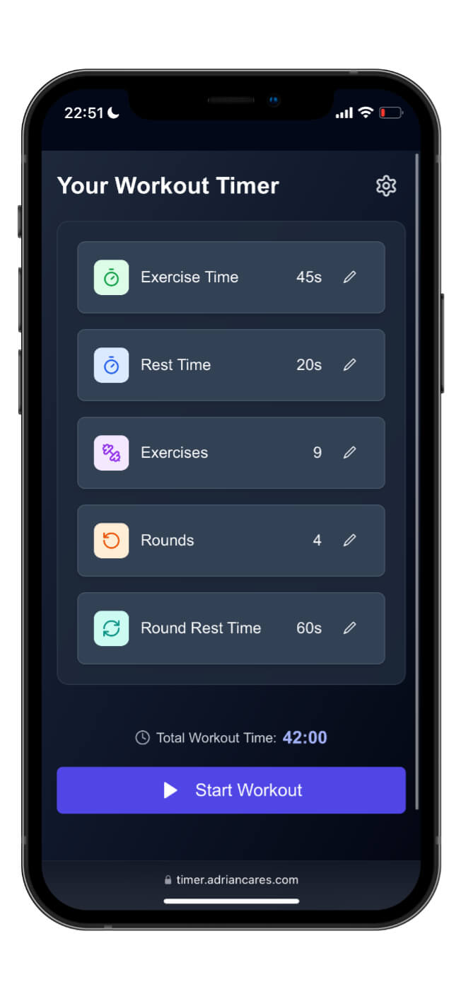
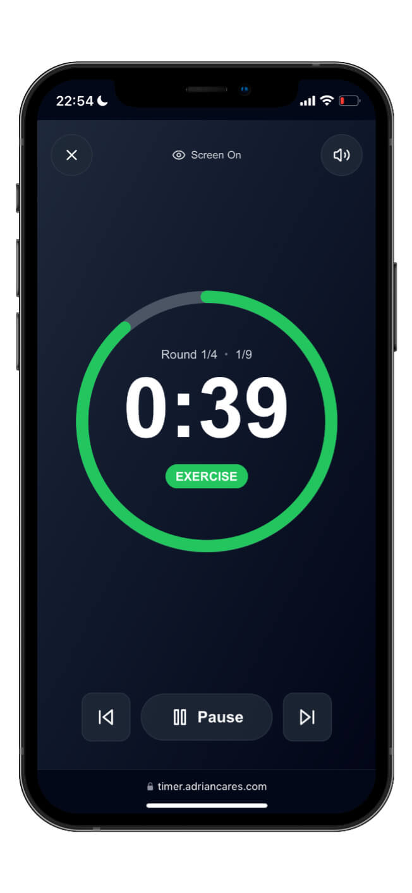

# HIIT Timer 
[](https://nextjs.org/) [](https://react.dev/) [](https://www.typescriptlang.org/) [](https://tailwindcss.com/) [](https://opensource.org/licenses/MIT) [](https://timer.adriancares.com)  [](https://cypress.io)

A modern, customizable High-Intensity Interval Training timer web application built with Next.js and TypeScript.

**[Try it here: timer.adriancares.com](https://timer.adriancares.com)**

## Screenshots

<div align="center">
  <table>
    <tr>
      <td align="center">
        
        <br />
        <em>Workout Configuration</em>
      </td>
      <td align="center">
        
        <br />
        <em>Active Workout Timer</em>
      </td>
    </tr>
  </table>
</div>

## Features

- ⚙️ **Fully Customizable Workouts**: Configure exercise time, rest periods, number of exercises, and rounds
- 🔊 **Audio Announcements**: Voice prompts for workout phases including "halfway there", "round complete", and "workout complete"
- ⏱️ **Timer Interface**: Visual circular progress indicator with clear time display
- ⏭️ **Skip Controls**: Navigate forward and backward through workout phases
- 📱 **Screen Wake Lock**: Prevents device screen from turning off during workouts
- 🌓 **Dark Mode Support**: Toggle between light and dark themes
- 📊 **Progress Tracking**: Workout streak counter to maintain motivation
- 📲 **Mobile Friendly**: Responsive design that works on all devices
- 🔌 **Offline Support**: Works without an internet connection
- 💾 **Settings Persistence**: Saves your workout preferences

## Getting Started

### Prerequisites

- Node.js 20.9.0 or newer (LTS)
- npm, yarn, or pnpm

### Installation

1. Clone the repository:
   ```bash
   git clone https://github.com/adriansprk/HIIT-Timer.git
   cd HIIT-Timer
   ```

2. Install dependencies:
   ```bash
   npm install
   # or
   yarn
   # or
   pnpm install
   ```

3. Start the development server:
   ```bash
   npm run dev
   # or
   yarn dev
   # or
   pnpm dev
   ```

4. Open [http://localhost:3000](http://localhost:3000) in your browser.

## Usage

1. **Configure Your Workout**:
   - Set exercise duration (in seconds)
   - Set rest period duration (in seconds)
   - Set round rest duration (in seconds)
   - Choose number of exercises per round
   - Choose number of rounds

2. **Start Your Workout**:
   - Press the "Start Workout" button
   - Follow the visual and audio cues
   - Use pause/play and skip controls as needed

3. **Complete Workout**:
   - Receive congratulations and workout statistics
   - View your streak progress
   - Start a new workout or return to the configuration screen

## Technology Stack

- **Framework**: Next.js 16.1.x with App Router
- **Language**: TypeScript
- **Styling**: Tailwind CSS 3.4.x
- **UI Components**: Custom components with Radix UI primitives
- **Icons**: Lucide React
- **State Management**: React Context API
- **Theme Switching**: next-themes
- **Audio**: Web Audio API
- **Screen Wake Lock**: Web Wake Lock API with video fallback for iOS
- **Testing**: Jest for unit and integration tests, Cypress for E2E tests
- **CI/CD**: GitHub Actions for automated testing and deployment

## Project Structure

```
HIIT-Timer/
├── app/              # Next.js App Router pages
├── components/       # React components
├── contexts/         # React Context providers
├── hooks/            # Custom React hooks
├── lib/              # Utility functions
├── styles/           # Global styles
├── public/           # Static assets
│   └── audio/        # Voice announcements
├── __tests__/        # Jest test files
│   ├── components/   # Component tests
│   ├── contexts/     # Context tests
│   ├── hooks/        # Hook tests
│   ├── integration/  # Integration tests
│   └── lib/          # Utility function tests
├── cypress/          # Cypress test files
│   ├── e2e/          # E2E test specifications
│   └── support/      # Test support files
├── .github/          # GitHub actions workflows
│   └── workflows/    # CI/CD pipeline definitions
├── docs/             # Documentation files
└── types/            # TypeScript type definitions
```

## Testing

This project employs a comprehensive testing strategy:

- **Unit Tests**: Testing individual components and utilities
- **Integration Tests**: Testing interactions between components
- **End-to-End Tests**: Cypress tests that simulate real user interactions

Run tests with:

```bash
# Run Jest tests
npm test

# Run Cypress tests in interactive mode
npm run cypress:open

# Run Cypress tests in headless mode
npm run cypress:run
```

For more detailed information about the testing architecture, see [docs/testing.md](docs/testing.md).

## Documentation

All documentation is centralized in the [docs folder](docs/) with an index for easy navigation.

- [Architecture Document](docs/architecture.md) - Detailed overview of the app architecture and design decisions
- [Audio System Documentation](docs/audio-system.md) - Documentation for the audio playback system
- [Testing Reference](docs/test-reference.md) - Reference guide for testing implementations

## License

This project is licensed under the MIT License 